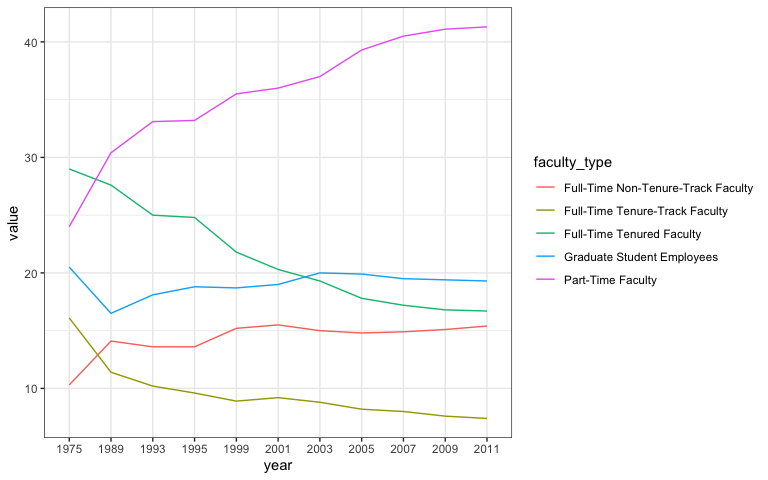

Lab 06 - Ugly charts and Simpson’s paradox
================
Benjamin Egan
2-17-25

### Load packages and data

``` r
library(tidyverse) 
library(dsbox)
library(ggplot2)
library(mosaicData) 
```

    ## Warning: package 'mosaicData' was built under R version 4.3.3

``` r
staff <- read_csv("data/instructional-staff.csv")
```

### Exercise 1

``` r
staff_long <- staff %>%
  pivot_longer(cols = -faculty_type, names_to = "year") %>%
  mutate(value = as.numeric(value))
```

### Staff by Year Graph

``` r
staff_long %>%
  ggplot(aes(
    x = year,
    y = value,
    group = faculty_type,
    color = faculty_type
  )) +
  geom_line()+
  theme_bw()+
  labs(
    x = "Year",
    y = "Percent of Total Instructional Staff",
    title = "Trends in Instructional Staff Employee Status",
    color = "Faculty Status"
  )
```

<!-- -->

### Fisheries Graph

``` r
fisheries <- read_csv("data/fisheries.csv")
```

    ## Rows: 216 Columns: 4
    ## ── Column specification ────────────────────────────────────────────────────────
    ## Delimiter: ","
    ## chr (1): country
    ## dbl (3): capture, aquaculture, total
    ## 
    ## ℹ Use `spec()` to retrieve the full column specification for this data.
    ## ℹ Specify the column types or set `show_col_types = FALSE` to quiet this message.

``` r
view(fisheries)
```

Looking at this data set, we have four variables. Country, capture,
aquaculture, and total. Based on their data, it’s clear that China leads
aquaculture by a landslide. One way we could visualize this is by taking
out China and individually reporting their statistics. It would help
with the visual. If we wanted to keep this in, I would create two
graphs, one for capture and one for aquaculture.

``` r
top_10 <- fisheries %>%
  arrange(desc(total)) %>%
    slice(1:10) 

fisheries %>% ggplot(aes(
  x = fct_reorder(country, total),
  y = total
)) +
  geom_bar(stat = "identity")+
  coord_flip()+
  labs(
    x = "Country",
    y = "Frequency",
    title = "Tonnage of Fish captured"
  )
```

<!-- -->

``` r
top_10 %>% ggplot(aes(
  x = fct_reorder(country, total),
  y = total
)) +
  geom_bar(stat = "identity", aes(y = aquaculture), alpha = .6, fill = "salmon")+
  geom_bar(stat = "identity", alpha = .6, fill = NA, color = "Black")+
  coord_flip()+
  labs(
    x = "Country",
    y = "Frequency",
    title = "Tonnage of Fish captured",
    subtitle = "purple indicates the proportion farmed via aquaculture"
  ) 
```

<!-- -->

Add exercise headings as needed.
