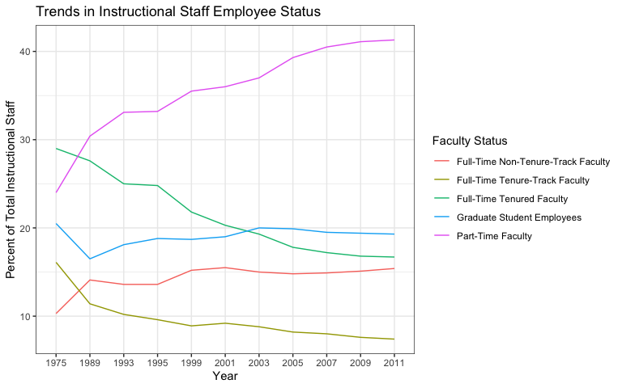

Lab 06 - Ugly charts and Simpson’s paradox
================
Benjamin Egan
2-17-25

### Load packages and data

``` r
library(tidyverse) 
library(dsbox)
library(mosaicData) 
```

    ## Warning: package 'mosaicData' was built under R version 4.3.3

``` r
staff <- read_csv("data/instructional-staff.csv")
```

### Exercise 1

``` r
staff_long <- staff %>%
  pivot_longer(cols = -faculty_type, names_to = "year") %>%
  mutate(value = as.numeric(value))
```

### Exercise 2

``` r
staff_long %>%
  ggplot(aes(
    x = year,
    y = value,
    group = faculty_type,
    color = faculty_type
  )) +
  geom_line()+
  theme_bw()
```

<!-- -->

### Exercise 3

…

Add exercise headings as needed.
